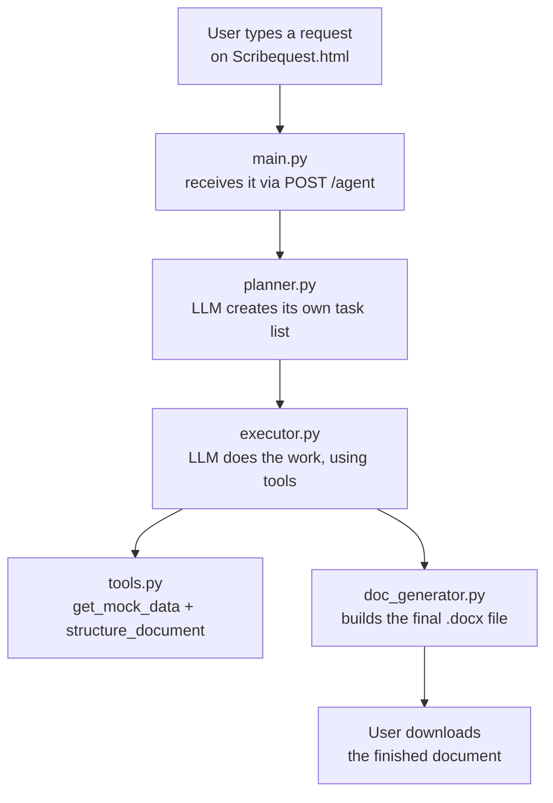

# 📜 ScribeQuest — Mini Planner Agent

[](https://www.python.org/)
[](https://fastapi.tiangolo.com/)
[](https://groq.com/)
[](https://python-docx.readthedocs.io/)
[](https://render.com/)
[]()

**An autonomous AI agent that plans its own steps, calls real tools, and writes a finished Word document — from one plain-English request.**


[🚀 Live Demo](https://planner-agent-pwkf.onrender.com) · [📡 API Docs](https://planner-agent-pwkf.onrender.com/docs) · [📂 Repository](https://github.com/Shravani-1325/scribequest-agent)

---

## 1. Project Overview

ScribeQuest is an autonomous agent, not a simple chatbot. Give it one sentence — like *"create a project plan for launching a mobile app"* — and it independently decides what kind of planned document to produce, it plans its own steps, gathers supporting data using real tool calls, and returns a ready-to-download `.docx` file.

> **Frontend:** a pixel-themed UI (`Scribequest.html`) served directly by the backend
> **Backend:** FastAPI + Groq (Llama 3.3 70B) — deployed as a single Render web service
> **Live URL:** <https://planner-agent-pwkf.onrender.com>

---

## 2. Problem Statement

Writing a first draft of a structured business document — a project plan, meeting minutes, an SOP, a learning roadmap  is repetitive. Someone still has to decide the right structure, fill it with realistic detail, and format it properly, every single time, from scratch.

> This creates three recurring pain points:
- Manually deciding document structure for every new request
- No consistent way to ground content in real supporting numbers
- Formatting a polished final file (not just a chat reply) takes extra manual work

---

## 3. Project Objective

> Build an autonomous system that:

| # | Goal | Description |
|---|---|---|
| G1 | Autonomous Planning | The LLM invents its own task list per request  no hardcoded templates |
| G2 | Tool Calling | The LLM can call real Python functions mid-execution, not just generate static text |
| G3 | Document Generation | Produce a real, polished, downloadable `.docx`  not just a chat reply |
| G4 | Resilience | Handle vague, incomplete, or malformed model output without crashing |
| G5 | Deployment | Ship the whole system as one publicly accessible live web app |

---

## 4. Data Understanding


ScribeQuest doesn't train on or query a static dataset the "data" is what flows *through* the pipeline at request time:

| Data | Where it comes from | Where it goes |
|---|---|---|
| The user's raw request (plain text) | Typed into the UI | Sent to the planner |
| The generated plan (JSON: document type, assumptions, steps) | LLM output from `planner.py` | Passed into the executor as context |
| Tool call arguments (e.g. a topic string) | Decided by the LLM mid-execution | Passed into real Python functions |
| Tool call results (mock metrics) | Simulated in `tools.py` | Fed back to the LLM to inform writing |
| Final structured content (title + sections) | LLM's final tool call | Passed into the document builder |

Nothing is stored long-term  each request is a self-contained round trip from text in, to `.docx` out.

---

## 5. Knowledge Base


ScribeQuest does **not** use a real external knowledge base or retrieval system (no RAG, no vector database). Grounding numbers budgets, timelines, growth percentages — come from a **simulated data tool** (`get_mock_data` in `tools.py`), since real business data wasn't in scope for this project.

This is an intentional design choice: the tool-calling architecture already has the right shape to plug in a *real* data source later  an internal API, a company database, or a proper RAG retriever  without changing anything else in the pipeline.

---

## 6. System Architecture

> Full System Chart 

Five files, each with one job, connected in a strict order for every request:


**What each piece does:**

- **`Scribequest.html`** — pixel UI. Sends the request to `/agent`, shows a live "thinking" timer, reveals a download button only once a real file exists.
- **`main.py`** — FastAPI entrypoint. Validates the request, runs the three pipeline stages in order, isolates errors per stage, and serves the frontend itself.
- **`planner.py`** — the "what should we do" stage. LLM invents its own JSON task list — document type, assumptions, ordered steps.
- **`executor.py`** — the "actually do it" stage. Runs a tool-calling loop, with adaptive retry (escalating strictness) if the model misfires a tool call.
- **`tools.py`** — defines what the LLM can call: the schema (what the model sees) and the real functions (what actually runs).
- **`doc_generator.py`** — plain Python, zero AI. Builds the final formatted `.docx` with `python-docx`.


**Deployment architecture:**

```
GitHub Repo (main branch)
        │  auto-deploy on push
        ▼
   Render Web Service (Free Tier)
        │  uvicorn main:app --host 0.0.0.0 --port $PORT
        ▼
   FastAPI serves BOTH /agent (API) and / (Scribequest.html)
        │
        ▼
   https://planner-agent-pwkf.onrender.com
```

---

## 7. Example Queries


| Type | Example |
|---|---|
| Standard business request | "Create a project plan for launching a new mobile app" |
| Time-bound learning plan | "I want to learn machine learning in 1 month" |
| Deliberately ambiguous | "We need some kind of document about our new feature rollout, not sure what format works best, maybe cover risks too" |

The ambiguous case has no specified document type and missing details on purpose  it tests whether the planner makes and states reasonable assumptions instead of failing.

---

## 8. Project Structure

```
scribequest-agent/
│
├── 📄 main.py              # FastAPI app — routes, validation, orchestration, serves frontend
├── 🧠 planner.py            # Autonomous planning stage
├── ⚙️ executor.py            # Tool-calling execution loop (with adaptive retry)
├── 🔧 tools.py               # Tool schemas + real tool implementations
├── 📝 doc_generator.py       # Builds the final .docx (no AI involved)
├── 🎨 Scribequest.html       # Pixel-themed frontend UI
├── 📦 requirements.txt       # Python dependencies
├── 🔑 .env                   # GROQ_API_KEY (never committed)
├── 🙈 .gitignore
└── 📘 README.md
```

---

## 9. API Reference

>### POST /agent

Runs the full pipeline for one request.

**Request:**
```json
{ "request": "Create a project plan for launching a mobile app" }
```

**Response (200 OK):**
```json
{
  "request": "...",
  "plan": { "document_type": "...", "assumptions": [...], "steps": [...] },
  "tool_calls": [ { "tool": "get_mock_data", "args": { "topic": "..." } } ],
  "document_title": "...",
  "document_path": "output/....docx",
  "download_url": "/download/....docx"
}
```

**Error Response (502):**
```json
{ "detail": "Execution step failed: ..." }
```

>### GET /download/{filename}

Returns the generated `.docx` file for download.

>### GET /

Serves the frontend (`Scribequest.html`).

---

## 10. Deployment

The application is deployed on **Render** (free tier) as a **single web service**  the API and frontend live together, no separate hosting needed.

🌐 **<https://planner-agent-pwkf.onrender.com>**

```
Platform  : Render Web Service (Free Tier)
Build     : pip install -r requirements.txt
Start     : uvicorn main:app --host 0.0.0.0 --port $PORT
Env var   : GROQ_API_KEY (set in Render dashboard, never committed)
Branch    : main (auto-deploy on push)
```

> ### ⚠️ Free Tier Note

Render's free tier spins down after ~15 minutes of inactivity. The **first request after idle time can take 30-60 seconds** while the instance wakes up — this is expected, not a bug.

Generated documents live only in the container's temporary filesystem  served immediately on generation, not expected to persist across restarts.

---

## 11. Author
Shravani More